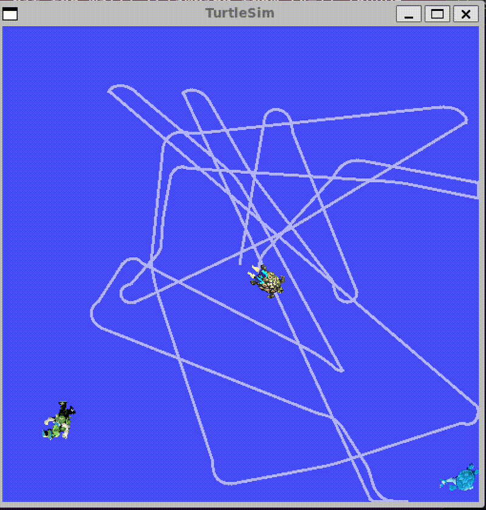

# Turtle Chase Simulation 🐢

A ROS 2 project built on **turtlesim** where a controller turtle autonomously chases and catches randomly spawned turtles. Features closest-target selection, smooth acceleration limiting, and state machine-based control logic.

## Demo


## How It Works

- `turtle_spawner` node randomly spawns turtles at intervals across the turtlesim window
- `turtle_controller` node drives `turtle1` to chase and catch them
- Controller uses a **state machine** (`IDLE → CHASING → CATCHING`) for clean transitions
- Optionally targets the **closest turtle first** based on Euclidean distance
- **Acceleration limiting** prevents jerky movements during chasing

## Package Structure

turtle-chase-ros/
├── turtlesim_pkg/
│ ├── turtlesim_pkg/
│ │ ├── spawner.py
│ │ └── turtle_controller.py
│ ├── package.xml
│ ├── setup.py
│ └── setup.cfg
└── my_robot_bringup/
├── launch/
│ └── turtlesim_catch_them_all.launch.xml
└── config/
└── catch_them_all.yaml

## Dependencies

- ROS 2 (Humble or later)
- `turtlesim`
- `my_robot_interfaces` (custom msgs/srvs: `Turtle`, `TurtleArray`, `CatchTurtle`)

## Build & Run

\```bash
# Clone into your ROS 2 workspace
cd ~/ros2_ws/src
git clone https://github.com/jainanshu0912/turtle-chase-ros.git

# Build
cd ~/ros2_ws
colcon build
source install/setup.bash

# Launch
ros2 launch my_robot_bringup turtlesim_catch_them_all.launch.xml
\```

## Parameters

| Parameter | Default | Description |
|---|---|---|
| `catch_closest_turtle_first` | `true` | Target nearest turtle by distance |
| `linear_speed_controller` | `2.0` | Linear speed multiplier |
| `angular_speed_controller` | `6.0` | Angular speed multiplier |
| `turtle_name_prefix` | `"turtle"` | Prefix for spawned turtle names |
| `spawn_frequency` | `1.0` | Turtles spawned per second |